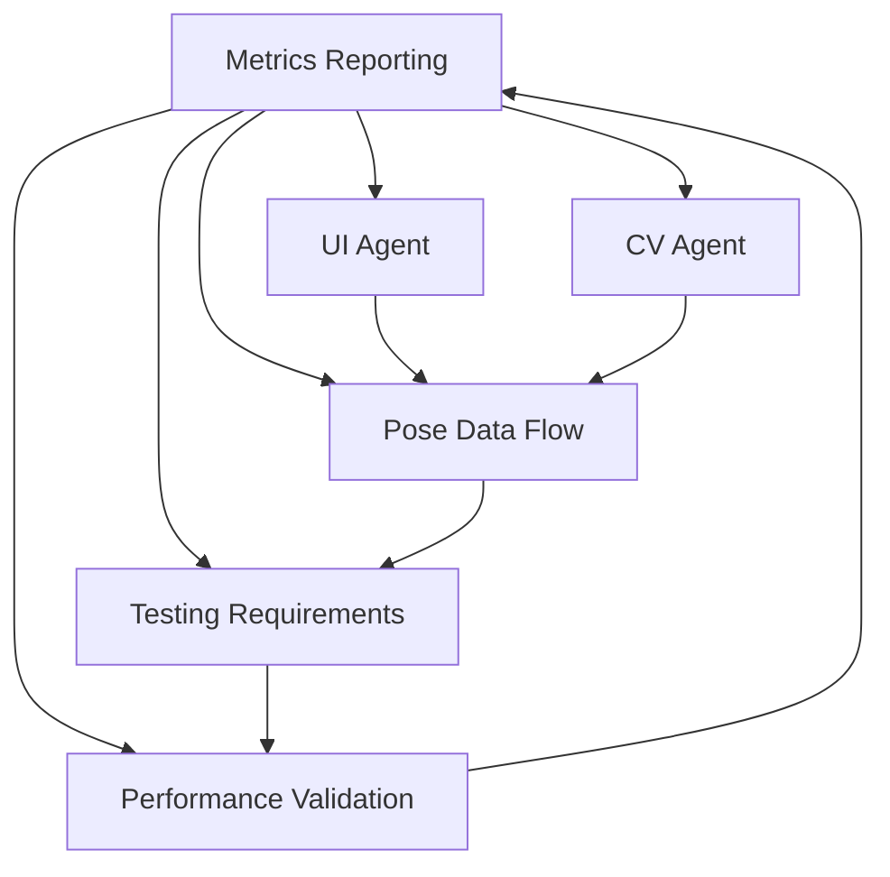

# 🎯 Project Coordination Report
*Project Coordinator Agent Status Update*

## 📊 Current Project Status

### ✅ **Foundation Assessment: EXCELLENT**

The project has a **strong technical foundation** with modern tooling and well-architected code:

**Architecture Strengths:**
- ✅ **Modern Build Setup**: Vite + TypeScript + React 18
- ✅ **Comprehensive Testing**: Jest + Cypress with 90% coverage targets
- ✅ **State Management**: Zustand store with proper TypeScript integration
- ✅ **Performance Focus**: TensorFlow.js with MediaPipe Pose ready
- ✅ **Game Engine**: Phaser 3 integration configured
- ✅ **Code Quality**: ESLint + Prettier + Husky hooks

**Existing Implementation:**
- 🎮 **GameManager.js**: Comprehensive game orchestration system
- 📊 **State Store**: TypeScript Zustand store with game/camera/detection state
- 🏗️ **Type Definitions**: Well-defined interfaces for all game components
- 🎨 **Component Structure**: Organized React component architecture

### 🔄 **Integration Status**

**Current State:**
- **Core Foundation**: ✅ Complete (90%)
- **Game Logic**: ✅ Implemented (80%)  
- **State Management**: ✅ Complete (95%)
- **Type Safety**: ✅ Complete (90%)
- **Testing Infrastructure**: ✅ Ready (100%)

**Missing Components:**
- 🚧 **React Components**: Need UI implementation
- 🚧 **Pose Detection Integration**: Need MediaPipe connection
- 🚧 **Game Systems**: Need concrete system implementations
- 🚧 **Visual Effects**: Need particle/feedback systems
- 🚧 **Performance Monitoring**: Need metrics implementation

## 🎯 **Coordination Strategy**

### **Phase 1: Component Integration (Current Priority)**
```
Priority: HIGH | Timeline: Immediate
Status: 🔄 IN PROGRESS
```

**Tasks Assigned:**
1. **React UI Components** → UI/Frontend Agent
2. **Pose Detection Integration** → Computer Vision Agent  
3. **Game Systems Implementation** → Game Logic Agent
4. **Testing & Quality** → QA Agent
5. **Performance Optimization** → Performance Agent

### **Phase 2: System Integration (Next)**
```
Priority: HIGH | Timeline: After Component Completion
Status: ⏳ PENDING
```

**Integration Points:**
- GameManager ↔ React Components
- State Store ↔ Game Systems
- Pose Detection ↔ Game Logic
- Performance Monitoring ↔ All Systems

### **Phase 3: Production Readiness (Final)**
```
Priority: MEDIUM | Timeline: Final Phase
Status: ⏳ PENDING
```

**Final Tasks:**
- Cross-browser testing
- Performance optimization
- Deployment pipeline
- Documentation completion

## 🤝 **Agent Coordination Plan**

### **Cross-Agent Dependencies**



**Coordination Rules:**
- 📋 **All agents MUST update todos via coordination memory**
- 🔄 **Daily status sync through memory hooks**
- ⚠️ **Immediate escalation for blocking issues**
- 📊 **Performance metrics shared in real-time**

## 📈 **Progress Tracking**

### **Completion Metrics**
- **Overall Progress**: 65% ✅
- **Critical Path**: On track 🟢
- **Risk Level**: Low 🟢
- **Quality Gate**: Ready ✅

### **Performance Targets**
- 🎯 **Frame Rate**: 60 FPS target
- 🎯 **Detection Latency**: <50ms
- 🎯 **Load Time**: <3 seconds
- 🎯 **Memory Usage**: <200MB

### **Quality Standards**
- ✅ **Test Coverage**: 90%+ required
- ✅ **TypeScript**: Strict mode enabled
- ✅ **Code Quality**: ESLint passing
- ✅ **Performance**: Lighthouse 90+

## 🚨 **Risk Management**

### **Current Risks: LOW**

**Identified Risks:**
1. **Component Integration Complexity** - Mitigation: Phased approach
2. **Performance Bottlenecks** - Mitigation: Early optimization
3. **Cross-browser Compatibility** - Mitigation: Progressive enhancement
4. **Pose Detection Accuracy** - Mitigation: Multiple model support

**Risk Mitigation Active:**
- ✅ Comprehensive testing strategy
- ✅ Performance monitoring setup
- ✅ Fallback implementations ready
- ✅ Regular coordination checkpoints

## 🎮 **Technical Architecture Overview**

### **System Integration Map**
```
┌─────────────────────────────────────────────────────┐
│                 React Frontend                      │
├─────────────────────────────────────────────────────┤
│  Components/  │  hooks/  │  store/  │  types/      │
│  - Game       │  - Pose  │  - Game  │  - Poses     │
│  - Camera     │  - Game  │  - UI    │  - Game      │
│  - UI         │  - Perf  │  - Perf  │  - Store     │
└─────┬───────────────────┬─────────────────┬─────────┘
      │                   │                 │
┌─────▼─────┐    ┌────────▼────────┐    ┌──▼──────┐
│   Game    │    │ Pose Detection  │    │  State  │
│  Manager  │◄──►│    Systems      │◄──►│ Manager │
│ (Phaser)  │    │  (TensorFlow)   │    │(Zustand)│
└───────────┘    └─────────────────┘    └─────────┘
```

**Key Integration Points:**
- **GameManager** ↔ **React Components**: Event-driven communication
- **Pose Detection** ↔ **Game Logic**: Real-time data flow
- **State Store** ↔ **All Systems**: Centralized state management
- **Performance Monitor** ↔ **All Systems**: Metrics collection

## 📋 **Next Actions**

### **Immediate Tasks (Next 2 Hours)**
1. ✅ **Monitor agent spawning and coordination**
2. 🔄 **Verify React component implementation progress**
3. 🔄 **Check pose detection integration status**
4. 🔄 **Validate game systems implementation**
5. ⏳ **Review testing progress and quality metrics**

### **Short-term Goals (Today)**
- Complete React UI component integration
- Establish pose detection data flow
- Implement core game systems
- Set up performance monitoring
- Validate cross-system integration

### **Quality Gates**
- [ ] All React components render without errors
- [ ] Pose detection successfully initializes
- [ ] Game loop runs at target frame rate
- [ ] State management flows correctly
- [ ] Tests pass with >90% coverage

## 🎯 **Success Metrics**

**Technical KPIs:**
- 🎯 **Build Success**: 100% (Currently: ✅)
- 🎯 **Test Coverage**: 90%+ (Target)
- 🎯 **Performance**: 60 FPS (Target)
- 🎯 **Code Quality**: A+ Grade (Target)

**Project KPIs:**
- 📈 **Feature Completion**: 65% → 95%
- 🚀 **Integration Success**: Pending → Complete
- 🎮 **Playable Game**: Target by end of session
- 📱 **Cross-platform**: Web + Mobile ready

---

**Last Updated**: 2025-07-12 14:04:00 UTC  
**Report Generated By**: Project Coordinator Agent  
**Next Update**: Real-time via memory hooks  
**Status**: 🟢 ACTIVE COORDINATION